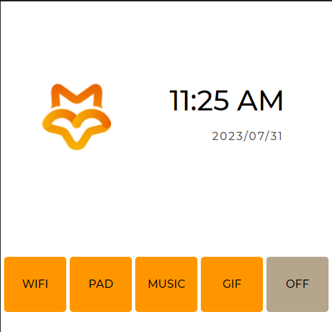

# Luckfox Pico LVGL example
[中文](./README_CN.md)
+ This example is based on GUI-Guider and lvgl-8.3 for designing the interface.
+ This example uses lv_driver-8.1 to drive display and input devices.
+ A graphical interface development example specifically for the `Luckfox Pico Ultra` series development boards.

## Platform Support
| Model              | Operating System | LF40-720720-ARK | LF40-480480-ARK |
|--------------------|------------------|-----------------|-----------------|
| Luckfox Pico Ultra | Buildroot        | Supported        | Supported        |
| Luckfox Pico Ultra W | Buildroot        | Supported        | Supported        |

## Implementation Results

+ **WIFI**: Configure the SSID and password for Wi-Fi. This button will not be displayed on the Luckfox Pico Ultra.
+ **PAD**: Touchscreen handwriting test.
+ **MUSIC**: Music playback, supports only `.mp3` format. Music files need to be placed in `/music`.
+ **GIF**: Animated GIF frame rate test.
+ **OFF**: Close the application.

## Compilation
+ Set environment variables:
    ```
    export LUCKFOX_SDK_PATH=<path_to_luckfox-pico_sdk>
    ```
    **Note:** Use absolute paths.

+ Compile with CMake to obtain the executable:
    ```
    mkdir build
    cd build
    cmake ..
    make -j
    ```

## Running
+ Upload the compiled executable `luckfox_lvgl_demo` to the Luckfox Pico (using adb, ssh, or other methods).
+ Set executable permissions and run:
    ```
    chmod a+x luckfox_lvgl_demo
    ./luckfox_lvgl_demo
    ```

## Detail
[RGB Screen](https://wiki.luckfox.com/Luckfox-Pico/Luckfox-Pico-Ultra-RGB-Screen/)
